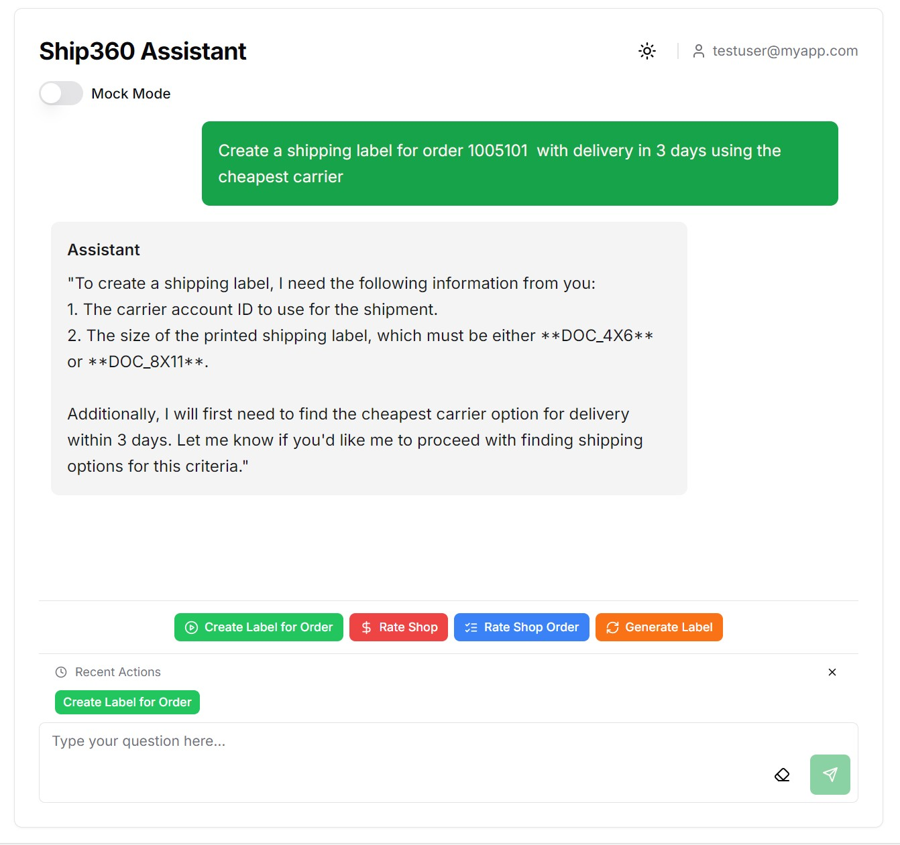

# Ship360 Assistant

A modern conversational AI interface for shipping operations using Azure OpenAI and Ship360 APIs. This project provides a natural language interface for shipping operations including rate shopping, label creation, shipment tracking, and shipment management.



## Repository Structure

### Core Application Components

- **ship360-chat-api/** - Backend API service built with FastAPI
  - `app/` - Main application code
    - `api/` - API routes and endpoints
    - `core/` - Core configuration and settings
    - `models/` - Data models and schemas
    - `plugins/` - Semantic Kernel plugins for shipping operations
    - `prompts/` - AI prompt templates
    - `services/` - Service integrations (Azure OpenAI, Ship360)
    - `utils/` - Utility functions
  - `tests/` - Unit and integration tests
  - `requirements.txt` - Python dependencies
  - `startup.py` - Application startup script
  - `README.md` - Backend documentation

- **ship360-ui/** - Frontend web interface built with Next.js
  - `app/` - Next.js application (App Router)
  - `components/` - React components
  - `lib/` - Utilities and configuration
  - `types/` - TypeScript type definitions
  - `public/` - Static assets
  - `package.json` - JavaScript dependencies
  - `README.md` - Frontend documentation

### Infrastructure and Deployment

- **infrastructure/** - Infrastructure and deployment code
  - `scripts/` - Deployment and management scripts
    - `test-deploy.ps1` - Script for testing deployments
    - `update-deployment.ps1` - Script for updating existing deployments
  - `templates/` - Infrastructure as Code templates (ARM, Bicep, etc.)
  - `config/` - Environment configuration files
    - `dev/` - Development environment configuration
    - `prod/` - Production environment configuration
  - `README.md` - Infrastructure documentation

### Documentation and Resources

- **docs/** - Project documentation
  - `Architecture Diagram.drawio` - System architecture diagram
  - `examples/` - Example code and configurations
    - `deploy-testing/` - Deployment testing examples
    - `helpers/` - Helper utilities
    - `notebooks/` - Jupyter notebooks for testing and development
    - `plugins/` - Example plugins
  - `prompts/` - Prompt engineering examples

- **markdown/** - Additional documentation in markdown format
  - `APIs.md` - API documentation
  - `Intent-Detection.md` - Intent detection system
  - `prompts.md` - Prompt engineering guidelines
  - `shipping-intents-categories.md` - Shipping intent categories
  - `use-case.md` - Use case documentation

- **images/** - Images and diagrams for documentation

## Getting Started

### Prerequisites

- Python 3.11+
- Node.js 18+
- npm or yarn
- Azure OpenAI service
- Ship360 API access

### Backend Setup (ship360-chat-api)

1. Navigate to the backend directory:
   ```bash
   cd ship360-chat-api
   ```

2. Create a virtual environment:
   ```bash
   python -m venv venv
   source venv/bin/activate  # On Windows: venv\Scripts\activate
   ```

3. Install dependencies:
   ```bash
   pip install -r requirements.txt
   ```

4. Create a `.env` file (copy from `.env_sample`):
   ```
   # Azure OpenAI configuration
   AZURE_OPENAI_ENDPOINT=https://your-openai-resource.openai.azure.com/
   AZURE_OPENAI_API_KEY=your-api-key
   AZURE_OPENAI_CHAT_DEPLOYMENT_NAME=gpt-4o
   AZURE_OPENAI_API_VERSION=2024-12-01-preview

   # Shipping 360 API configuration
   SP360_TOKEN_URL=https://api-dev.sendpro360.pitneycloud.com/auth/api/v1/token
   SP360_TOKEN_USERNAME=your-username
   SP360_TOKEN_PASSWORD=your-password
   SP360_RATE_SHOP_URL=https://api-dev.sendpro360.pitneycloud.com/shippingservices/v1/rates
   SP360_SHIPMENTS_URL=https://api-dev.sendpro360.pitneycloud.com/shippingservices/v1/shipments
   SP360_TRACKING_URL=https://api-dev.sendpro360.pitneycloud.com/shippingservices/v1/tracking
   ```

5. Start the FastAPI server:
   ```bash
   uvicorn app.main:app --reload --port 8000
   ```

### Frontend Setup (ship360-ui)

1. Navigate to the frontend directory:
   ```bash
   cd ship360-ui
   ```

2. Install dependencies:
   ```bash
   npm install
   ```

3. Create a `.env.local` file:
   ```
   # Backend API configuration
   NEXT_PUBLIC_API_BASE_URL=http://localhost:8000

   # Development settings
   NEXT_PUBLIC_TEST_USER=testuser@ship360.com
   NEXT_PUBLIC_API_KEY=your-api-key
   ```

4. Start the development server:
   ```bash
   npm run dev
   ```

## Deployment

### Using Deployment Scripts

1. Navigate to the infrastructure directory:
   ```bash
   cd infrastructure
   ```

2. Configure your environment variables in the appropriate config directory (dev/prod)

3. Run the deployment script:
   ```powershell
   ./scripts/test-deploy.ps1 -EnvironmentName <your-environment>
   ```

4. For updates to existing deployments:
   ```powershell
   ./scripts/update-deployment.ps1 -EnvironmentName <your-environment>
   ```

## Available Shipping Operations

The Ship360 Assistant supports the following shipping operations:

- **Rate Shopping**: Compare shipping rates across carriers
- **Label Generation**: Create shipping labels with carrier selection
- **Shipment Tracking**: Track packages using tracking numbers
- **Shipment Management**: View and manage existing shipments

## Branch Protection Rules

- **Restrict deletions**: No one can delete the main branch
- **Require pull requests**: All changes must go through a PR with at least one approval
- **Dismiss stale approvals**: New commits require fresh approvals
- **Require status checks**: PRs can only be merged if all required checks pass
- **Require branches to be up-to-date**: PRs must be current with main before merging
- **Block force pushes**: Force pushes to main are not allowed

## Contributing

1. Fork the repository
2. Create your feature branch: `git checkout -b feature/your-feature`
3. Commit your changes: `git commit -m 'Add some feature'`
4. Push to the branch: `git push origin feature/your-feature`
5. Open a Pull Request

## License

This project is licensed under the MIT License - see the [LICENSE](LICENSE) file for details.
