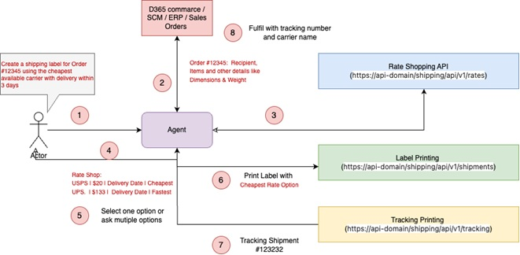

# prompts
User prompts will be : 

- "Create a shipping label for Order #12345 using the cheapest available carrier with delivery within 3 days."
- "Rate shop for the best shipping option for this package: 10x6x4 inches, 2 lbs, shipping from 10001 to 94105."
- "Compare rates for FedEx, UPS, and USPS for a shipment from Atlanta to Seattle, and select the most cost-effective with tracking."
- "Generate a shipping label with the fastest delivery time under $15 for this order #2433232."

## Events

