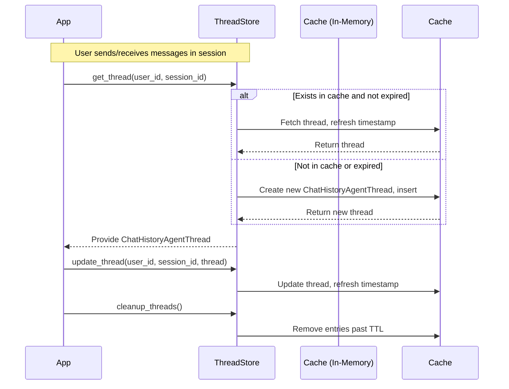
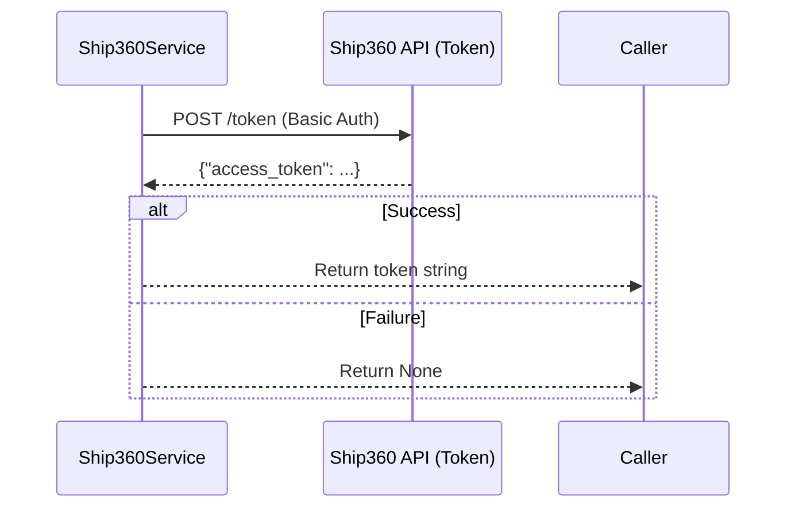

# `thread_store.py` – In-Memory Chat Thread Store Service

## Overview

The `thread_store.py` module implements a thread-safe, in-memory store for managing user session chat threads within the Ship360 Chat API service. Its primary responsibility is to associate and manage conversational context (`ChatHistoryAgentThread` objects) for users across sessions. This component is essential for features requiring context retention, multi-turn dialog, and efficient contextual lookup per user session. 

By caching threads in-process and managing their lifetime, the service minimizes overhead, reduces database round-trips, and preserves responsiveness for active user interactions.

## Core Functionality

- **Thread-Safe In-Memory Storage**: Utilizes a Python `dict` protected by a `threading.Lock` to ensure safe concurrent access/modification.
- **Composite Cache Key**: Distinguishes threads using a tuple of `(user_id, session_id)`, enabling multi-session tracking per user.
- **Automatic Expiry (TTL)**: Supports configurable time-to-live to control resource usage and enforce session freshness.
- **Efficient Lifecycle Management**: Lazily creates, updates, and purges threads as dictated by access and expiration policies.

---

## In-Memory Caching Design

### Cache Key Construction

The cache stores objects using a composite key:

```python
ThreadKey = Tuple[str, str]  # (user_id, session_id)
```

This ensures that every user's session receives its own isolated chat thread context:

- `user_id` – Unique identifier for the user.
- `session_id` – Unique token for the chat session.

Access to a thread is always performed via both parameters, e.g.:

```python
thread = thread_store.get_thread(user_id="Alice", session_id="sess42")
```

### Storage Structure

Internally, the store uses:

```python
self._store: Dict[ThreadKey, Tuple[ChatHistoryAgentThread, float]]
```

Each entry maps a user/session pair to a tuple:
- `ChatHistoryAgentThread` – The session's conversational context object.
- `last_access_time` (`float`) – Timestamp of last read or write (UNIX time).

---

## TTL and Eviction Mechanism

### Time-To-Live (TTL) Behavior

Each thread has a configurable TTL (default: 3600 seconds = 1 hour). The TTL controls how long an inactive thread is retained before eviction.

#### How It Works

- **On Access or Update:** Whenever a thread is fetched (`get_thread`) or explicitly updated (`update_thread`), its last accessed timestamp is refreshed to the current time.
- **On Cleanup:** When `cleanup_threads()` is called (should be periodically or at key moments by the application), the service iterates through all entries and removes any threads whose `last_access_time` is older than `TTL` seconds ago.

#### Eviction Process

- Thread-safe iteration finds all expired threads.
- These threads are deleted from the store, freeing resources and ensuring stale session data does not persist.

### Example Interface Usage

```python
# Fetches thread, creating it if absent, and refreshes TTL
thread = thread_store.get_thread("user123", "sess789")

# Updates thread (e.g., after message append), refreshing TTL
thread_store.update_thread("user123", "sess789", thread)

# Manually remove a specific thread/session context
thread_store.delete_thread("user123", "sess789")

# Purge expired threads; should be run periodically
thread_store.cleanup_threads()
```

---

## Lifecycle Visualization

Below is a sequence diagram (Mermaid) illustrating the life of a chat thread in the cache:



---

## ThreadStore API Reference (Key Methods)

```python
class ThreadStore:
    def get_thread(self, user_id: str, session_id: str) -> ChatHistoryAgentThread
    def update_thread(self, user_id: str, session_id: str, thread: ChatHistoryAgentThread)
    def delete_thread(self, user_id: str, session_id: str)
    def cleanup_threads(self)
    def get_all_keys(self) -> List[ThreadKey]
```
For singleton usage:
```python
from .thread_store import thread_store  # Singleton instance
```

---

## Summary

`thread_store.py` enables efficient per-session conversational state management in memory for the Ship360 Chat API. Its thread-safe caching, composite keying, and TTL eviction collectively facilitate both scalability and freshness for user experiences across chat sessions.
---

# `ship_360_service.py` – Ship360Service: Centralized External Shipping Rates Integration

## Overview

The `Ship360Service` class coordinates communication with the Ship360 external APIs, providing authentication and centralized "rate shopping" (carrier/service quote comparisons) for shipping orders from within the Ship360 Chat API application.

**Purpose and Role:**
- Abstracts all authentication and rate quote interactions with Ship360 APIs.
- Ensures secure, reliable fetching of available shipping rates/options for a given order.
- Encapsulates business logic for rate filtering and selection according to user or application criteria.

This service is critical for presenting users with curated shipping options based on price, delivery duration, and carrier constraints, while securely managing API access tokens.

---

## API Integrations

The service interacts with:
- **Ship360 Authentication API**: Issues bearer tokens for secure API communication.
- **Ship360 Rate Shop API**: Returns a list of carrier rate options for a supplied shipment order.

---

## Class Definition

```python
from app.services.ship_360_service import Ship360Service

service = Ship360Service()
```

---

## Methods

### 1. `async def get_sp360_token(self) -> Optional[str]`

**Description**  
Obtains a new bearer token from the Ship360 Authentication API using credentials/config from application settings.

**External API:**  
- `POST {SP360_TOKEN_URL}` (with HTTP Basic Auth)

**Rationale:**  
Required for secure, authenticated access to Ship360's protected endpoints. Tokens are short-lived and must be refreshed per API request or expiration.

**Data Flow & Steps:**



**Representative Usage:**
```python
token = await service.get_sp360_token()
if token:
    # Use token...
```

---

### 2. `async def perform_rate_shop(self, order: dict, max_price: float = 0.0, duration_value: int = 0, duration_operator: str = "less_than_or_equal") -> dict`

**Description**  
Performs a "rate shop" by requesting all available shipping quotes for the provided order, then filters and sorts them according to business logic.

**External API:**  
- `POST {SP360_RATE_SHOP_URL}` (with Bearer token in Auth header)

**Rationale:**  
Provides users with a curated list of viable shipping options for a given order, factoring in cost and delivery commitments.

#### Parameters
- `order` (`dict`): Full order structure (as expected by Ship360 Rate API).
- `max_price` (`float`): Maximum allowed price for a rate option (filters expensive quotes).
- `duration_value` (`int`): Maximum (or threshold) of delivery days for options.
- `duration_operator` (`str`): Comparison operator for duration filtering (`"less_than"` or `"less_than_or_equal"`; see Enum below).

#### Data Flow & Step-by-Step

```mermaid
flowchart TD
    A[Start: Receive order + filters] --> B[Get Bearer token using get_sp360_token()]
    B -->|token| C[POST /rate-shop (Bearer token, order JSON)]
    C --> D{API Response Status}
    D -- 200 OK --> E[Extract rates list]
    E --> F[Filter out options with totalCarrierCharge==0]
    F --> G{max_price > 0?}
    G -- Yes --> H[Filter rates above max_price]
    G -- No --> I[Pass rates unfiltered]
    H --> J
    I --> J
    J{duration_value > 0?}
    J -- Yes --> K[Apply operator (less_than/less_than_or_equal) on duration fields]
    J -- No --> L[Skip duration filtering]
    K --> M[Sort remaining options by price]
    L --> M
    M --> N[Return final list as dict: shippingOptions, total_options, filtered_count]
    D -- Otherwise --> O[Return error dict with status and error text]
```

**Representative Usage:**
```python
order_data = {
    # ...order dict following Ship360 requirements...
}

result = await service.perform_rate_shop(
    order=order_data,
    max_price=100.00,
    duration_value=2,
    duration_operator="less_than_or_equal"
)

if "shippingOptions" in result:
    for option in result["shippingOptions"]:
        print(option)
elif "error" in result:
    print("Rate shop failed:", result["error"])
```

**Representative Output:**
```python
{
    "total_options": 3,
    "filtered_count": 5,
    "shippingOptions": [
        {
            "carrierName": "FedEx",
            "serviceLevel": "Ground",
            "totalCarrierCharge": 23.12,
            "deliveryCommitment": {
                "minEstimatedNumberOfDays": 1,
                "maxEstimatedNumberOfDays": 2
            },
            ...
        },
        # Additional options...
    ]
}
```

**ComparisonOperator Enum:**
```python
class ComparisonOperator(str, enum.Enum):
    LESS_THAN = "less_than"
    LESS_THAN_OR_EQUAL = "less_than_or_equal"
```

---

## Maintenance and Extension Notes

- All service configuration (API URLs, credentials) are loaded from [`app.core.config.settings`](../../core/config.py).
- Extend `Ship360Service` to add new Ship360 API integrations by following the async, bearer-authenticated pattern exemplified here.
- Error responses from the API are surfaced in result dicts for caller handling.

---